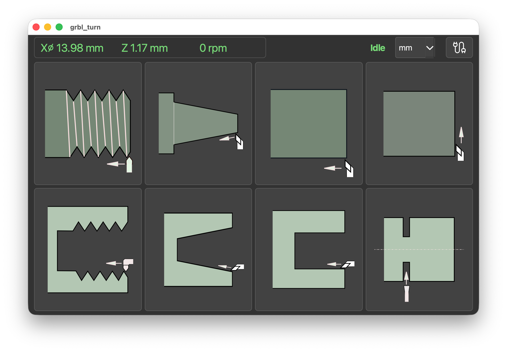
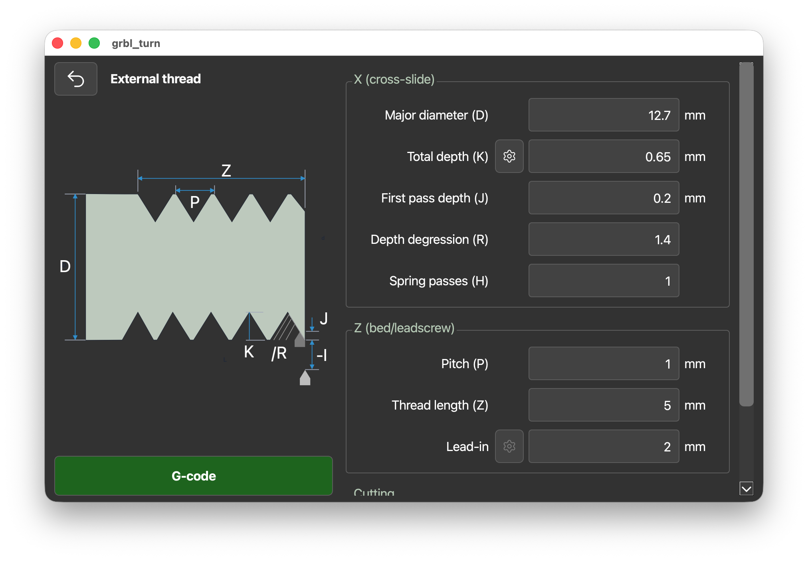

* grbl_turn — make ezNC2 even easier to use

** Screenshots

** Description

Pick a lathe operation, enter parameters, then preview/simulate/run
the generated G-code.

Cross-platform: Windows, macOS, Linux, Raspberry Pi.  Works very well 
on 7" touch screen (800x480) as well as large computer screen.

** Install & run
Install python 3.10+ first, then run corresponding install-* script for your OS.

=install-pi-lite.sh=  for Raspberry Pi (64bit) without x11 desktop, tested with Bookworm

=install-ubuntu.sh=  for Ubuntu and most Linux, tested on Ubuntu 22.04

=install-win.bat=  for Windows, tested on Windows 10

** Conventions
- X0 = spindle centerline, Z0 = part face, Z negative into the work.
- Dialogs take *diameters*; emitted X words are *radii* (stock GRBL).
  If your firmware runs lathe diameter mode, set
  =x_words_are_diameter=True= in =grbl_turn/machine.py=.
- Units (inch/mm) are selected on the main page; programs declare
  G20/G21 accordingly. Switching units converts all saved parameters
  (diameters, lengths, feeds) — except thread pitch, which is entered
  as TPI or a custom in/rev value in inch mode, and as mm/rev in mm mode.
- The app never touches the spindle (no M3/M5/S words) — set the speed
  and start it yourself before pressing Run, stop it after.

** Threading
Requires spindle-synchronized motion in the firmware (encoder). Emits a
G76 cycle by default; set =has_g76=False= in the machine profile to emit
explicit G33 passes computed by the app (same degressive infeed math).
*Feed hold is deferred during a synced pass* — the pass finishes before
motion stops. Use the machine E-stop for real emergencies.

** Connectivity
- Serial: USB, default 115200 baud.
- WiFi: raw TCP ("telnet") to the controller [not tested]
- Simulator: in-process fake GRBL for trying the UI and testing.

